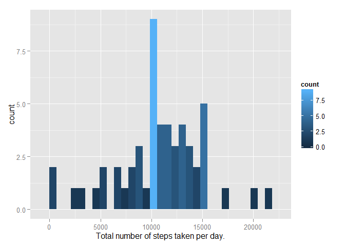
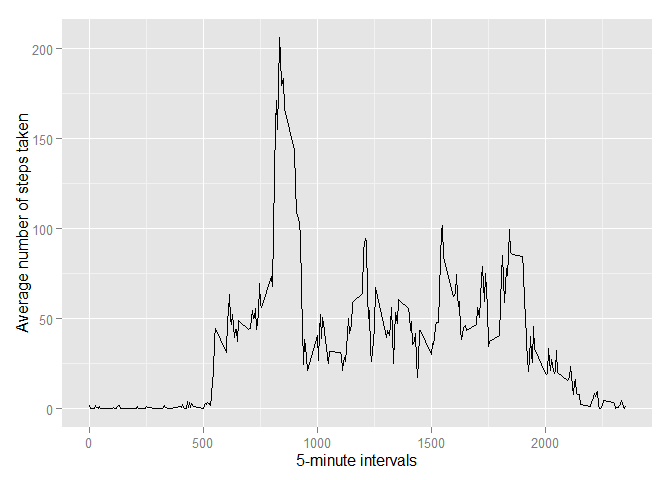
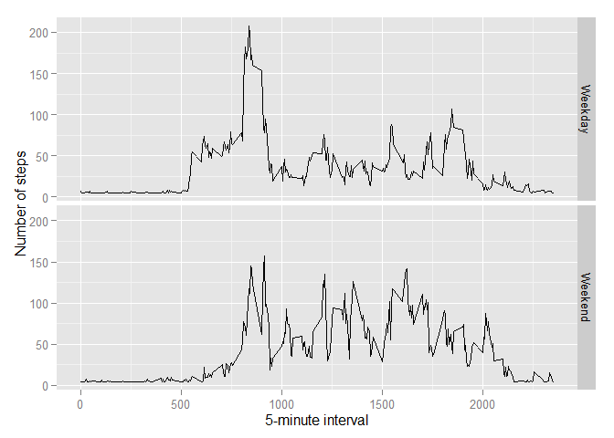

# Reproducible Reasearch: Peer Assessment 1
Ritch Melton  
Sunday, August 16, 2015  

## Synopsis
In this report we examine activity data from a single individual wearing a commerically available activity tracker. The dataset we use is publically available and encompasses the months of October and November 2012. Our analysis is descriptive and provides insights into into daily activity patterns and examines the difference in daily activity on weekdays versus weekends.


### Obtaining and reading the data.
To obtain the data, we used the github link provided in the assignment and the git application using the Windows 10 operating system. From a powershell shell session we executed the following commands.

```
Set-Location D:\Projects\
& git clone git@github.com:rdpeng/RepData_PeerAssessment1
````

### Reading in the data.
Using R, we check for the existance of the csv data and extract it if neccessary. The CSV file is delimited with commas and missing values are coded as NA. We read in the single line header to obtain column names. We imported the steps and interval columns as numeric data and we converted the date field to an R date type.


```r
setwd('D:/Projects/RepData_PeerAssessment1')
if (!file.exists("activity.csv")) {
  unzip("activity.zip")
}

data  <- read.csv('activity.csv', na.strings="NA", colClasses=c("numeric", "character", "numeric"), as.is=TRUE)
data$date <- as.Date(data$date)
```

After reading in the 17568 observations contained in the dataset, we examine the first few rows.

```r
dim(data)
```

```
## [1] 17568     3
```

```r
head(data, 4)
```

```
##   steps       date interval
## 1    NA 2012-10-01        0
## 2    NA 2012-10-01        5
## 3    NA 2012-10-01       10
## 4    NA 2012-10-01       15
```

## Results

### What is mean total number of steps taken per day?
We first sought to understand the mean total number of steps taken per day. As a first step, we computed the total number of steps taken per day and created a histogram with those value. The values have a somewhat normal distribution with a large number of steps-per-day around the 10,000 mark. There are some noticable gaps in the tails of the distribution which seem to indicate that days of light activity and days of extreme activity might be outliers.


```r
library(ggplot2)

data$dateFactors <- as.factor(data$date)

perDay <- aggregate(data$steps, by=list(Day=data$dateFactors), FUN=sum)
colnames(perDay) <- c('day', 'steps')
g <- ggplot(perDay, aes(x=steps, fill=..count..)) +
  geom_histogram() +
  xlab("Total number of steps taken per day.")

print(g)
```

```
## stat_bin: binwidth defaulted to range/30. Use 'binwidth = x' to adjust this.
```

 

We then obtained a five number summary of the number of steps per day to yield mean and median values of 10770 and 10760 respectively.


```r
summary(perDay$steps)
```

```
##    Min. 1st Qu.  Median    Mean 3rd Qu.    Max.    NA's 
##      41    8841   10760   10770   13290   21190       8
```


## What is the average daily activity pattern?
After examining the steps per day, we constructed a time series plot of the 5-minute interval (x-axis) and the average number of steps taken averaged across all days (y-axis).

```r
dailyPattern <- aggregate(x=list(steps=data$steps), by=list(interval=data$interval), FUN=mean, na.rm=TRUE)

g <- ggplot(dailyPattern, aes(x=interval, y=steps)) +
  geom_line() +
  xlab("5-minute intervals") +
  ylab("Average number of steps taken")
print(g)
```

 

We then obtained the interval (835) that had the maximum value on average across all the days in the dataset (206.2 steps).


```r
dailyPattern[which.max(dailyPattern$steps), ]
```

```
##     interval    steps
## 104      835 206.1698
```


## Imputing missing values
With concern about the bias the NA values had on our results, we computed the number of NA values in the dataset and found there were 2304 NA values for steps.

```r
sum(is.na(data$steps))
```

```
## [1] 2304
```

We decided to create a dataset with those values replaced with the mean value computed earlier (10770).

```r
noNAs <- data
noNAs$steps[is.na(noNAs$steps)] <- mean(data$steps, na.rm=TRUE)
```

To help understand the difference this processing had on our results, we repeated our previous analysis.


```r
perDay1 <- aggregate(data$steps, by=list(Day=data$dateFactors), FUN=sum)
colnames(perDay1) <- c('day', 'steps')
perDay2 <- aggregate(noNAs$steps, by=list(Day=data$dateFactors), FUN=sum)
colnames(perDay2) <- c('day', 'steps')

g <- ggplot(perDay, aes(x=steps, fill=..count..)) +
  geom_histogram() +
  xlab("Total number of steps taken per day.")
print(g)
```

```
## stat_bin: binwidth defaulted to range/30. Use 'binwidth = x' to adjust this.
```

 

We then computed the difference between the mean and median values. While the mean values where the same, we found a small difference in the median values of approximately 1.18. Since we used the mean value these differences were expected.
 

```r
diff <- c(abs(mean(perDay1$steps, na.rm=TRUE) - mean(perDay2$steps)), abs(median(perDay1$steps, na.rm=TRUE) - median(perDay2$steps)))
diff
```

```
## [1] 0.000000 1.188679
```


## Are there differences in activity patterns between weekdays and weekends?

Lastly, we created a factor with two levels that divided the dataset into "weekday" and "weekend" days. Using this factor, we computed factor plots of the average number of steps taken on weekdays and weekends.

```r
noNAs$days <- weekdays(noNAs$date)
noNAs[noNAs$days == "Sunday" | noNAs$days == "Saturday",]$days <- "Weekend"
noNAs[noNAs$days != "Weekend",]$days <- "Weekday"
noNAs$days <- as.factor(noNAs$days)

averages <- aggregate(steps ~ interval + days, data = noNAs, mean)
g <- ggplot(averages, aes(interval, steps)) +
    geom_line() +
    facet_grid(days ~ .) + 
    xlab("5-minute interval") +
    ylab("Number of steps")

print(g)
```

 

